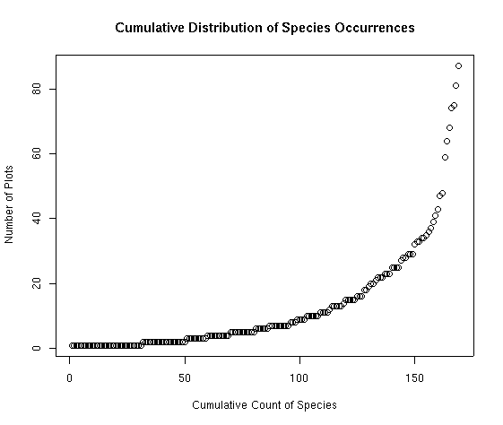
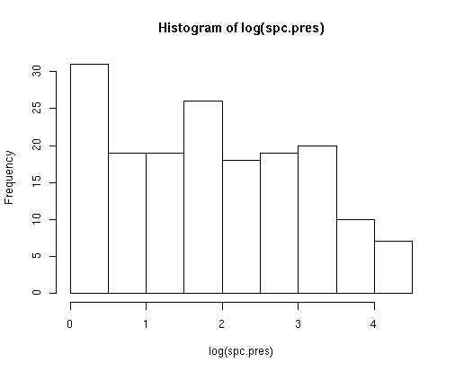
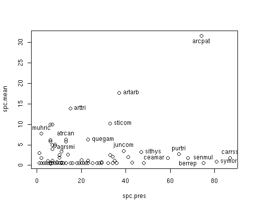
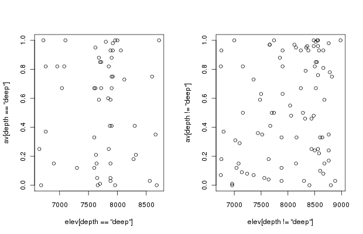
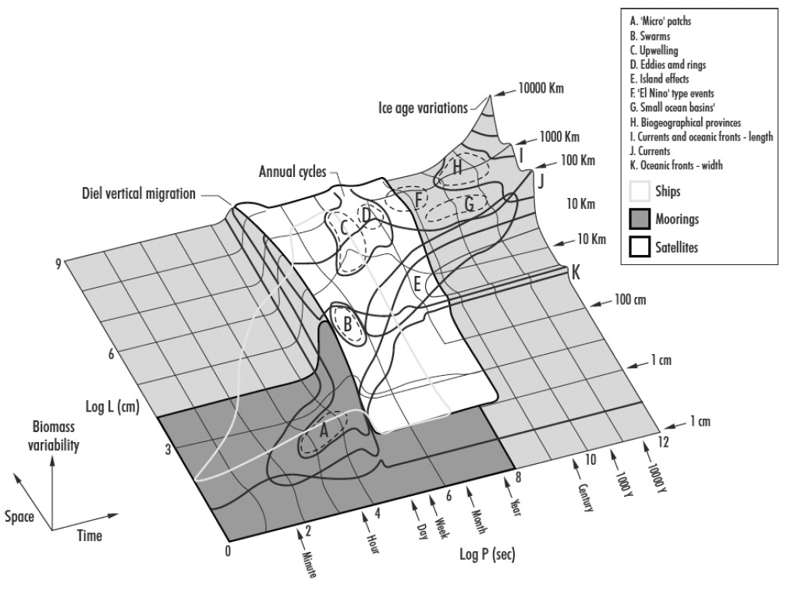

# Lab 1: R, Data Management, ggplot2, Stommel Diagram 

[RMarkdown Version](lab1_R.Rmd)

This lab has THREE Parts in addition to your participation in the Lab Community Forum for this lab (link to the Google Shared Drive on D2L in the description for "LABS"). Note that you only need to hand in Part 3 (Stommel Diagram), due in the D2L Lab 1 Assignment Box by the Lab Due Date (Mondays @ 5pm US Eastern: refer to the syllabus for exact date). 

At the end of Lab 1 is Homework in preparation for Lab 2. 

## Part 1: R & Data Management

R (https://www.r-project.org/) is an elegant scripting language. With R you can do just about anything to analyze or plot your data. You can even do things without data (e.g., theoretical modeling). One of the best things about R is that scientists of all sorts contribute to it by providing R packages (i.e., sets of code) that focus on a set of analyses (like time series analysis, spatial analysis, etc.). And it’s free. So chances are, if you are looking to do something with your data, there’s at least one package out there that can do it! Sometimes it might take time to find it, but using a variety of keywords has always turned up some portion of code that is useable for a data application I’ve needed. And if you don’t find what you’re looking for, consider writing a package as a contribution. 

R RESOURCES
There are numerous tutorials, books, short courses, etc. out there to help you learn R. See the Resources in the course D2L folder, "Resources" for just a few relevant links to help you beyond this course. There are also resources posted on the MSU SpaCE Lab website at: https://space-lab-msu.github.io/r_guide/. 
The exercises below draw on bits and pieces from some of these sources, but also some aspects that I think are particularly important to understand about R. Even if you’ve worked with R before, you may find some of these descriptions and codes useful. I’m always learning new things in R from a variety of sources - from my students, postdocs, and colleagues, and from websites and scientific papers and conferences. 

### FAIR Principles

Data should be Findable, Accessible, Interoperable, and Reusable (FAIR). Read Wilkinson et al. (2016) to become familiar with these standards, as we will be referring to them throughout the course.

Wilkinson, M. D., M. Dumontier, Ij. J. Aalbersberg, G. Appleton, M. Axton, A. Baak, N. Blomberg, J.-W. Boiten, L. B. da Silva Santos, P. E. Bourne, J. Bouwman, A. J. Brookes, T. Clark, M. Crosas, I. Dillo, O. Dumon, S. Edmunds, C. T. Evelo, R. Finkers, A. Gonzalez-Beltran, A. J. G. Gray, P. Groth, C. Goble, J. S. Grethe, J. Heringa, P. A. C. ’t Hoen, R. Hooft, T. Kuhn, R. Kok, J. Kok, S. J. Lusher, M. E. Martone, A. Mons, A. L. Packer, B. Persson, P. Rocca-Serra, M. Roos, R. van Schaik, S.-A. Sansone, E. Schultes, T. Sengstag, T. Slater, G. Strawn, M. A. Swertz, M. Thompson, J. van der Lei, E. van Mulligen, J. Velterop, A. Waagmeester, P. Wittenburg, K. Wolstencroft, J. Zhao, and B. Mons. 2016. The FAIR Guiding Principles for scientific data management and stewardship. Scientific Data 3:160018. DOI:10.1038/sdata.2016.18.

You can also review the FAIR Principles at this website: https://www.go-fair.org/fair-principles/

### DATA MANAGEMENT is key to your success as a scientist or practitioner. 

One of the most important (and time consuming) steps with your data is organizing it. The readings for this lab will focus on that. Rather than work in Excel or another point and click program, R will enable you to track your changes from the very beginning. This is extremely important because chances are, you’ll need to re-run your organization script at some point during your analysis because you’ve realized you made some mistake along the way. It also vastly reduces human error because it provides you with a track record for reproducible research.

Please make sure you have read Borer et al. (2009) and White et al. (2013) and are familiar with proper data entry and management. If you follow these guidelines I guarantee you’ll be more efficient. For more in-depth information, see the 2011 ESA workshop, “How to Manage Ecological Data for Effective Use and Re-use”: https://www.dataone.org/esa-2011-how-manage-ecological-data-effective-use-and-re-use. The papers are on D2L, as are links to other data management resources in our Resources folder.

Elizabeth T. Borer, Eric W. Seabloom, Matthew B. Jones, and Mark Schildhauer 2009. Some Simple Guidelines for Effective Data Management. Bulletin of the Ecological Society of America 90:205–214. http://dx.doi.org/10.1890/0012-9623-90.2.205

White, E., E. Baldridge, Z. T. Brym, K. J. Locey, D. J. McGlinn, and S. R. Supp. 2013. Nine simple ways to make it easier to (re)use your data. Ideas in Ecology and Evolution 6.


### R & RSTUDIO: 

Download R (https://www.r-project.org/) and RStudio (https://www.rstudio.com/). R developers have funny names for R versions. Can you figure out their theme? You will use RStudio for lab (which runs R and has a nice layout… it also contains R Markdown which we will use for generating reports; see related homework ahead of Lab 2 at the end of this document). 

Some helpful tips when starting up R:
```{r, message=FALSE, warning=FALSE}
#Clear all existing data
rm(list=ls())

#Close graphics devices
graphics.off()
```
For purely reproducible research, it's not recommended to set your working directory. This is because any code you write should be able to run from any computer, reading in data from a raw data folder housed on some server or cloud location (i.e., ideally not your personal computer). 

Get in the habit of removing any spaces in your pathnames and filenames. Use “_” instead. No special characters; just ASCII characters (American Standard Code for Information Interchange).

Set paths for the location where the data exist (these directories (folders) may already exist, or you can create them through R). 

```{r, message=FALSE, results='hide',warning=FALSE}
data_path<-file.path("data","lab1")
output_path<-"output"

# install/load appropriate packages used in your script.
# in this case install ggplot2 package then load it
install.packages('ggplot2',repos = "http://cran.us.r-project.org") 
# you may be required to pick a source – pick one near where you are located
library(ggplot2) #Load ggplot2: 'https://ggplot2.tidyverse.org/reference/'
# If you install several packages at once, you can use code like this to 
# install and load them:
# *hint: if you're using R Markdown to knit with these commands, it may
# be helpful to install the package locally first (run this before knitting if you're 
# knitting in R Markdown - more on that in Lab 2)
for (package in c("dplyr", "ggplot2", "labdsv")) {
  if (!require(package, character.only=T, quietly=T)) {
    install.packages(package)
    library(package, character.only=T)
  }
}
```

If you use ggplot2, you may want to change the default settings for plotting (which is a gray background). I usually make these changes below. There are also options for adjusting the orientation of text on the axis labels. See the ggplot2 theme documentation: https://ggplot2.tidyverse.org/reference/theme.html for how to make your own theme.

```{r}
theme_set(theme_bw(10))
theme_update(axis.text.x = element_text(size = 10),axis.text.y = element_text(size = 10))
```

Managing your workspace

```{r, message=FALSE}
# As you go, save your workspace
save.image(file.path(data_path,"lab1.RData")) 
# Load the workspace (e.g. if you start back up but don’t want to re-run 
# everything you already worked on)
load(file.path(data_path,"lab1.RData"))
```
As you go, save your R script. (Refer to shortcut in File-Save menu). 

## Part 2: Practice with R and ggplot2

Ahead of the course, I recommended working through this R tutorial: https://datacarpentry.org/R-ecology-lesson/index.html.
If you would like more practice, complete Part 2 of this lab. You don't need to hand in anything for this portion of the lab. If you get stuck, ask a question on the Lab Community Forum for Lab 1.
If you are already a pro at ggplot2 and R, you can skip this and begin working on Part 3 and the Homework prep for Lab 2. However, you should still weigh in on the Lab Community Forum to offer advice to your colleagues.

Data for the following exercise are also on D2L in the Lab 1 folder.

Navigate to: http://ecology.msu.montana.edu/labdsv/R/labs/lab1/lab1.html and continue to the 2-panel plot on the next page: http://ecology.msu.montana.edu/labdsv/R/labs/lab2/lab2.html
These are exercises written by Dr. David Roberts, Montana State University. He has written several R packages: http://ecology.msu.montana.edu/droberts/droberts.html. For more info on the data used in the tutorial see: http://www.davidzeleny.net/anadat-r/doku.php/en:data:bryce 

Practice your skills with ggplot2 by recreating the following plots in ggplot2: (note the 4th plot is a 2-part plot from ). 


http://ecology.msu.montana.edu/labdsv/R/labs/lab1/cedfspc.png


http://ecology.msu.montana.edu/labdsv/R/labs/lab1/spc_histo2.png



http://ecology.msu.montana.edu/labdsv/R/labs/lab1/spcplt.png




http://ecology.msu.montana.edu/labdsv/R/labs/lab2/elev_av_depth.png 


Relevant commands include:

geom_point (https://ggplot2.tidyverse.org/reference/geom_point.html) 

geom_histogram (https://ggplot2.tidyverse.org/reference/geom_histogram.html) 

geom_text (https://ggplot2.tidyverse.org/reference/geom_text.html) 

ggsave (https://ggplot2.tidyverse.org/reference/ggsave.html)

labs (https://ggplot2.tidyverse.org/reference/labs.html)  

facet_grid (https://ggplot2.tidyverse.org/reference/facet_grid.html) 

facet_wrap (https://ggplot2.tidyverse.org/reference/facet_wrap.html) 


## Part 3: Stommel Diagram 

In lecture we went over the history of scale as it relates to ecology and natural science. For this portion of your lab, create a Stommel Diagram for the system you study (or some component of the system you study). It doesn’t need to be drawn in 3D as in Stommel’s original diagram. It can be 2D and look more like the Boreal Forest Ecosystem Diagram. 

Label your axes and place approximate values on your tick-marks. X-axis=space, Y-axis=time. Pick at least one response variable to plot as your Z-axis. Label the phenomena associated with your response variable. Use the examples from lecture as a guide. 

On your diagram, include a depiction of data sources as in Kaiser et al. 2005 (and FYI, here’s a better link to the shading on that diagram from lecture: http://rs.resalliance.org/wp-content/uploads/2010/02/stommelteaching.jpg



You can see that the ships cover a narrower range within the satellite range but also overlap the finer scales of the moorings).

Write a brief paragraph describing the diagram and pointing out key relationships. Include relevant in-line citations and a list of references. If you hand-draw the diagram, scan it in or take a photo of it to make it digital. 

## Homework in preparation for Lab 2:

R MARKDOWN: R Markdown is an authoring framework for R code and output. It’s handy because it produces nice summaries of your work in HTML or PDF or other formats. This document was made in Markdown via RStudio.
a.	Watch the intro video here: http://rmarkdown.rstudio.com/lesson-1.html
b.	Work through the tutorial and cover “How it Works”, “Code Chunks”, and “Markdown Basics”. I recommend using “KnitR” when you want to publish (i.e., click on “knit to HTML”, “knit to PDF”, etc. in the pull-down menu in RStudio).
