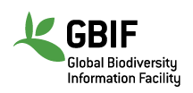

# Lab 7: Open Data

*[RMarkdown version of this Lab](lab7.Rmd)*

In this lab, the focus is on **open access data** (a.k.a. publicly available data). Open access data are vital to moving science forward — both in terms of advancing basic science and applied science. Open data are also essential for making decisions based on the *“best available science”*, including informing policy and management. 

In Lab 1, you were introduced to the **FAIR Data Principles** — the idea that data should be:

- **F**indable  
- **A**ccessible  
- **I**nteroperable  
- **R**eusable  

Wilkinson et al. (2016) outlines these standards:

> Wilkinson, M. D., M. Dumontier, Ij. J. Aalbersberg, G. Appleton, M. Axton, A. Baak, N. Blomberg, J.-W. Boiten, L. B. da Silva Santos, P. E. Bourne, J. Bouwman, A. J. Brookes, T. Clark, M. Crosas, I. Dillo, O. Dumon, S. Edmunds, C. T. Evelo, R. Finkers, A. Gonzalez-Beltran, A. J. G. Gray, P. Groth, C. Goble, J. S. Grethe, J. Heringa, P. A. C. ’t Hoen, R. Hooft, T. Kuhn, R. Kok, J. Kok, S. J. Lusher, M. E. Martone, A. Mons, A. L. Packer, B. Persson, P. Rocca-Serra, M. Roos, R. van Schaik, S.-A. Sansone, E. Schultes, T. Sengstag, T. Slater, G. Strawn, M. A. Swertz, M. Thompson, J. van der Lei, E. van Mulligen, J. Velterop, A. Waagmeester, P. Wittenburg, K. Wolstencroft, J. Zhao, and B. Mons. 2016. *The FAIR Guiding Principles for scientific data management and stewardship.* **Scientific Data 3:160018.** DOI:10.1038/sdata.2016.18.

Please review these principles as you will need to address them in your write-up.  
You can also review the FAIR Principles at this website: [https://www.go-fair.org/fair-principles/](https://www.go-fair.org/fair-principles/)

---

Interested in contributing to open access data?  
**Citizen Science** is another area that has been growing in popularity and utility for gaining data across space and time. These data come with their own considerations as they are not systematically collected.

Check out:

- [iNaturalist](https://www.inaturalist.org/)  
- [eBird](https://ebird.org/home)  

These are two well-established citizen science datasets. Consider joining as a user! The records contributed by citizen scientists that are considered *“research grade”* are incorporated into **GBIF**.

<div style="text-align:center;">
  
  
</div>

---

## Open Data Summary

For this lab assignment, you will **summarize a publicly available spatially-explicit dataset** (i.e., data are geographically referenced) using the RMarkdown template below.  

We suggest you find a dataset related to your graduate work and planned paper for the course as this will help you explore potential data for your analyses.  

You will need to hand in a **PDF produced from R Markdown**, including any images, plots, code, and text for answers to the questions. 

---

### ⚠️ The following open access datasets have already been summarized in prior semesters
Please find a *different* open access dataset.

- MTBS  
- DNR Forest Cover (IFMAP)  
- National Phenology Network  
- Historical DNR Forest Cover  
- NAWQA  
- North American Breeding Bird Survey  
- PRISM Climate Data  
- NOAA Climate Data  
- GBIF spatial occurrences  
- MEaSUReS 25km resolution snow cover data  
- OBIS (Ocean Biogeographic Information System)  
- NLCD (National Land Cover Database)  
- Terra MODIS Vegetation Continuous Fields (VCF)  
- WorldClim climate data  

---

### If you’re stuck on selecting a dataset, try searching these repositories:

- [EPA Environmental Dataset Gateway](https://edg.epa.gov/metadata/catalog/main/home.page)  
- [Michigan GIS Open Data](https://gis-michigan.opendata.arcgis.com/)  
- [USGS GIS Data](https://www.usgs.gov/products/data-and-tools/gis-data)  
- [NEON Data Portal](https://www.neonscience.org/)  
- [Environmental Data Initiative](https://portal.edirepository.org/nis/home.jsp)  
- [DataONE Network](https://www.dataone.org/)

Our [bioXgeo research group](https://www.communityecologylab.com/macrosystems-biology--patterns-of-biodiversity.html) has also compiled a list of **abiotic satellite remotely-sensed data** that could be useful for your research:  
[https://bioxgeo.github.io/bioXgeo_ProductsTable/](https://bioxgeo.github.io/bioXgeo_ProductsTable/)

---

## Follow the R Markdown template below to include the following:

1. **Category of data**  
2. **Short description of the data** (include range of spatial grain & extent, temporal grain & extent — more detail than in the example below)  
3. **Link to the data online**  
4. **Linked data logo (if applicable)**  
5. **Data use policy link**  
6. **Alignment with the FAIR Data Principles**  
   - Evaluate how well these data meet the Findable, Accessible, Interoperable, and Reusable (FAIR) Principles in a few sentences.  
7. **Suggestions for use in R**  
   - R packages to use when importing these data  
   - Code necessary to import them  
   - If direct import isn’t possible, include a link to instructions for downloading/uploading  
   - Include a small image of the data (a map or screenshot)

---

## Example Template for GBIF: Global Biodiversity Information Facility

**1. Data Category:**  
Species Occurrences  

**2. Data Description:**  
GBIF is the Global Biodiversity Information Facility which provides free and open access to biodiversity data.  
Spatial and temporal scale of occurrences varies depending on the species of interest.  

**3. Data Link:**  
[http://www.gbif.org/](http://www.gbif.org/)  

**4. Image/icon/logo for these data:**  



**5. Data Use Policy:**  
[https://www.gbif.org/data-use](https://www.gbif.org/data-use)  

**6. How these Data align with the FAIR Data Principles:**  
[Insert a few sentences evaluating how well these data meet the Findable, Accessible, Interoperable, and Reusable (FAIR) Principles.]  

**7. Use with R:**  
GBIF data on species occurrences can be downloaded directly for certain species using the **R package** `dismo`, as shown below for *Indri indri* (the largest living lemur).  

For use with software other than R, select filters to download occurrence data here:  
[http://www.gbif.org/occurrence/search](http://www.gbif.org/occurrence/search)

```{r, echo=FALSE}
# Define variable containing url
pic <- "./lab7_files/PL_Zarnetske_2012-05-10_65.jpg"
```

<center></center>

Indri (Indri indri), Analamazaotra Special Reserve, Madagascar.
Phoebe L. Zarnetske 2012.

```{r, echo=TRUE}

# install.packages("geodata") # install packages locally before knitting
library(dismo)   # package to easily download gbif occurrence data
library(geodata) # package to access geographic data
?geodata

# Load any additional packages needed for plotting.
indri.gbif <- gbif("Indri", "indri", geo = TRUE)

# Administrative boundaries for Madagascar (MDG):
# gadm function using geodata package. Also see: http://www.gadm.org/
mada <- gadm(country = "MDG", level = 0)

plot(mada, main = "Indri indri GBIF occurrence records")
points(indri.gbif$lon, indri.gbif$lat, pch = 19, cex = 0.5, col = "blue")

# Continue plotting to add a north arrow, scalebar, and axes for the plot.
```

<a rel="license" href="http://creativecommons.org/licenses/by/4.0/">  </a> This work is licensed under a <a rel="license" href="http://creativecommons.org/licenses/by/4.0/"> Licensed under CC-BY 4.0 2025 by Phoebe Zarnetske </a>. ```